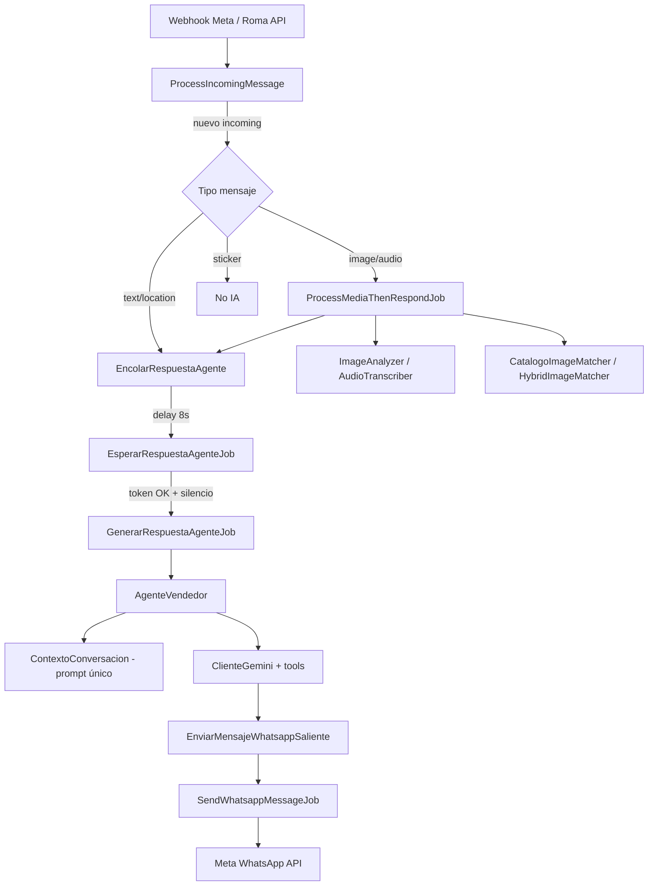
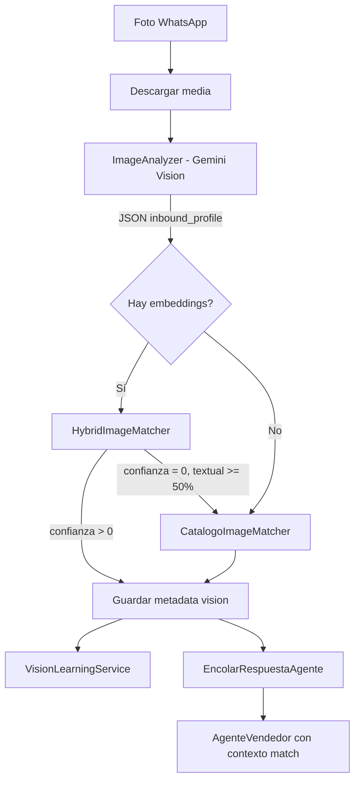
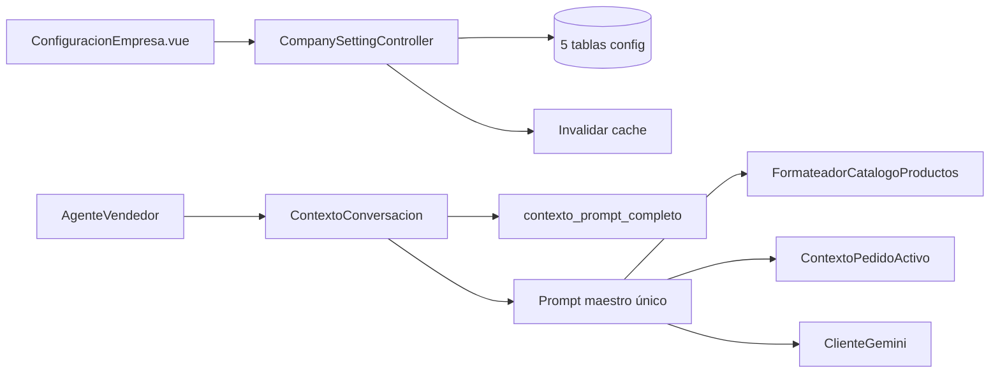

# RomaAgent — Documento de Arquitectura y Flujos

> **Propósito:** Handoff completo para que otra IA (o desarrollador) revise, mejore y continúe el proyecto sin perder contexto.  
> **Fecha:** 2026-06-08  
> **Stack:** Laravel 12 · Inertia Vue 3 · Tailwind · MySQL · Colas DB · Pusher · Gemini · WhatsApp Cloud API

---

## Tabla de contenidos

1. [Resumen ejecutivo](#1-resumen-ejecutivo)
2. [Estructura del proyecto](#2-estructura-del-proyecto)
3. [Rutas y capas HTTP](#3-rutas-y-capas-http)
4. [Modelos y dominio](#4-modelos-y-dominio)
5. [Flujo WhatsApp end-to-end](#5-flujo-whatsapp-end-to-end)
6. [Flujo del agente IA](#6-flujo-del-agente-ia)
7. [Configuración en un solo prompt](#7-configuración-en-un-solo-prompt)
8. [Flujo visión + embeddings](#8-flujo-visión--embeddings)
9. [Pipeline de ventas](#9-pipeline-de-ventas)
10. [Frontend (Inertia + Vue)](#10-frontend-inertia--vue)
11. [Variables de entorno](#11-variables-de-entorno)
12. [Comandos Artisan](#12-comandos-artisan)
13. [Jobs y colas](#13-jobs-y-colas)
14. [Herramientas del agente (function calling)](#14-herramientas-del-agente-function-calling)
15. [Tests](#15-tests)
16. [Fixes recientes (sesión 2026-06-08)](#16-fixes-recientes-sesión-2026-06-08)
17. [Issues conocidos y mejoras pendientes](#17-issues-conocidos-y-mejoras-pendientes)
18. [Diagramas de flujo](#18-diagramas-de-flujo)
19. [Archivos clave por tarea](#19-archivos-clave-por-tarea)

---

## 1. Resumen ejecutivo

**RomaAgent** es un CRM de WhatsApp para una tienda de ropa (Roma Store). Permite:

- Recibir y responder mensajes de WhatsApp (texto, imagen, audio, ubicación).
- Atender con un **bot IA** (Gemini) o modo **humano** (IA pausada por cliente).
- Gestionar **catálogo** de productos con variantes por color y talla.
- Reconocer **fotos de prendas** enviadas por clientas (visión + embeddings).
- Gestionar **pipeline de ventas** (pedidos, pagos, envíos).
- Configurar toda la empresa/IA desde un panel web.

### Flujo principal en una línea

```
WhatsApp → Webhook → Message en BD → (media?) ProcessMediaThenRespondJob
  → (imagen?) Gemini Vision + Matcher → Debounce → GenerarRespuestaAgenteJob
  → AgenteVendedor + Prompt maestro + Tools → SendWhatsappMessageJob → WhatsApp
```

### Qué NO es cada cosa

| Concepto | Qué hace | Qué NO hace |
|----------|----------|-------------|
| `WHATSAPP_ACCESS_TOKEN` | Descargar/enviar media y mensajes por Meta API | Analizar imágenes con IA |
| API key Gemini (`AgenteConfig`) | Visión, transcripción, embeddings, respuestas IA | Enviar WhatsApp |
| Embeddings | Matching vectorial catálogo vs descripción de foto | Analizar la foto entrante (eso es Gemini Vision) |
| Matcher textual | Comparar perfil JSON vs `vision_profile` del producto | Ver píxeles de la imagen |

---

## 2. Estructura del proyecto

```
RomaAgent/
├── app/
│   ├── Actions/                    # Casos de uso (ProcessIncomingMessage, GenerarRespuestaAgente…)
│   ├── Console/Commands/           # Artisan commands (vision, embeddings, recordatorios…)
│   ├── Enums/                      # SaleStatus, SaleTransitionType
│   ├── Exceptions/                 # GeminiQuotaExceededException
│   ├── Http/Controllers/
│   │   ├── Api/                    # Webhooks, REST API para Vue
│   │   ├── Admin/                  # VisionEmbeddingController
│   │   └── Auth/, Settings/
│   ├── Infrastructure/Whatsapp/    # RomaWhatsappClient, MetaWhatsAppClient
│   ├── Jobs/                       # 6 jobs en cola
│   ├── Models/                     # 13 modelos Eloquent
│   ├── Services/
│   │   ├── Agente/                 # AgenteVendedor, EjecutorHerramientasAgente, Tools
│   │   ├── Media/                  # ImageAnalyzer, AudioTranscriber, DescargadorMediaWhatsapp
│   │   ├── Vision/                 # HybridImageMatcher, ProductEmbeddingService…
│   └── Support/                    # FormateadorCatalogoProductos, ParseadorRespuestaJsonGemini…
├── bootstrap/app.php               # Middleware Laravel 12
├── config/                         # services.php, queue, broadcasting…
├── database/migrations/            # ~35 migraciones
├── resources/js/
│   ├── pages/                      # 27 páginas Inertia
│   ├── components/                 # ~150 componentes Vue
│   └── composables/                # useChat, useChatRealtime…
├── routes/
│   ├── web.php                     # Rutas Inertia + admin visión
│   ├── api.php                     # Webhooks + REST API
│   ├── auth.php
│   └── settings.php
└── tests/                          # ~75 tests Feature + Unit
```

### Versiones del ecosistema

| Paquete | Versión |
|---------|---------|
| PHP | 8.2 |
| Laravel | 12 |
| Inertia Laravel | 2 |
| Inertia Vue | 2 |
| Vue | 3 |
| Tailwind | 3 |
| PHPUnit | 11 |

---

## 3. Rutas y capas HTTP

### 3.1 Webhooks (públicos)

| Ruta | Controlador | Auth |
|------|-------------|------|
| `GET\|POST /api/whatsapp/webhook` | `WhatsappWebhookController` | Meta verify token (GET) |
| `GET\|POST /api/webhook` | Alias del anterior | Igual |
| `POST /api/roma/messages` | `RomaMessageController` | `ROMA_SYNC_TOKEN` |

**Archivo:** `routes/api.php`  
**Controlador Meta:** `app/Http/Controllers/Api/WhatsappWebhookController.php`

### 3.2 API autenticada (Vue SPA)

Grupo: `['web', 'auth', 'throttle:api']`

| Prefijo | Uso |
|---------|-----|
| `/api/messages`, `/api/conversations` | Chat CRM |
| `/api/products`, `/api/product-variants` | Catálogo |
| `/api/sales` | Pipeline ventas |
| `/api/customers` | Clientes + `ia-mode` |
| `/api/company-settings` | Config empresa/IA + `prompt-completo` |
| `/api/estado-ia` | Estado global IA + alerta cuota Gemini |

### 3.3 Rutas web (Inertia)

Grupo: `['auth', 'verified']` — **Archivo:** `routes/web.php`

| Ruta | Página Vue |
|------|------------|
| `/chat` | `Chat/Index.vue` |
| `/pipeline` | `Pipeline/Index.vue` |
| `/clientes` | `Clientes/Index.vue` |
| `/productos` | `Productos/Index.vue`, `Create.vue`, `Edit.vue` |
| `/categorias` | `Categorias/Index.vue` |
| `/zonas-delivery` | `ZonasDelivery/Index.vue` |
| `/configuracion/empresa` | `Configuracion/ConfiguracionEmpresa.vue` |
| `/admin/vision/embeddings` | `Admin/Vision/Embeddings.vue` |
| `/admin/vision/training` | `Admin/Vision/Training.vue` |

### 3.4 Schedule (cron)

**Archivo:** `routes/console.php`

```php
Schedule::command('pedidos:recordatorios')->everyMinute();
Schedule::command('vision:diagnostics')->weekly();
```

---

## 4. Modelos y dominio

### 4.1 Product

- **Estados:** `disponible`, `agotado`, `oculto`
- **Soft deletes**
- **Relaciones:** `category`, `variants`, `similares`, `sales`
- **Campos IA:**
  - `vision_profile` (JSON): tipo_prenda, material, patrón, keywords, detalles
  - `tags_ia` (array)
- **Método:** `sincronizarEstadoPorStock()` — actualiza estado según stock

### 4.2 ProductVariant

- **Relación:** `product`
- **Campos IA:**
  - `image_embedding` (array float, vector JSON)
  - `color_profile` (JSON: color_canonical, colores_dominantes, aliases)
  - `embedding_at` (timestamp)
- **Campos negocio:**
  - `color`, `sizes_stock` (mapa talla→stock), `image_path`

### 4.3 Customer

- `phone_number`, `name`
- `ia_paused`, `ia_pause_reason` — pausa IA por cliente
- `active_sale_id` — pedido activo
- `last_inbound_at`, recordatorios 3min/15min

### 4.4 Message

- `direction`: `incoming` | `outgoing`
- `content` — texto mostrado en UI
- `metadata` (JSON):
  - WhatsApp: `whatsapp_raw`, `local_url`, `media_url`, `mime_type`
  - Visión: `vision`, `vision_failed`, `vision_error`
  - Audio: `transcript`, `transcript_failed`
  - IA: `generated_by`, `model`, `agent_iterations`

### 4.5 Sale

- Enum `SaleStatus`: PagoPendiente → PagoRecibido → Confirmado → Enviado → Entregado
- Relaciones: `customer`, `product`, `productVariant`, `confirmedByUser`

### 4.6 CompanySetting (coordinador de config)

Refactorizado de un "God Object" a 5 tablas especializadas:

| Relación | Tabla | Contenido |
|----------|-------|-----------|
| `empresaInfo()` | `empresa_info_configs` | Nombre, celular, email, actividad |
| `agente()` | `agente_configs` | IA: activado, modelo, API key cifrada, temperatura, personalidad |
| `mensajes()` | `mensaje_configs` | Saludo, reglas, flujo, plantillas |
| `ventas()` | `venta_configs` | Métodos pago, moneda, comisión tarjeta |
| `horarios()` | `horario_configs` | Horarios entrega, políticas |

### 4.7 Otras tablas

| Tabla | Uso |
|-------|-----|
| `vision_learning_feedback` | Matches de visión para entrenamiento |
| `logs_ia` | Log requests/responses Gemini |
| `delivery_zones` | Zonas delivery con horarios |
| `producto_similares` | Productos relacionados |

---

## 5. Flujo WhatsApp end-to-end

### 5.1 Entrada webhook Meta

```
WhatsappWebhookController::handle()
  ├─ GET → verify() — hub_mode/challenge con WHATSAPP_VERIFY_TOKEN
  └─ POST → receive()
       └─ foreach entry.changes.value
            ├─ messages → NormalizadorWebhookMeta::normalizarMensaje()
            │              → enriquecerMedia() (DescargadorMediaWhatsapp)
            │              → NormalizadorWebhookMeta::aPayloadCrm()
            │              → ProcessIncomingMessage::execute()
            └─ statuses → NormalizadorWebhookMeta::normalizarStatus()
                           → UpdateMessageStatus::execute()
```

### 5.2 Entrada webhook Roma (legacy)

```
RomaMessageController::receive()
  ├─ AutenticacionWebhookRoma::verify()
  ├─ isStatusUpdate()? → UpdateMessageStatus
  └─ ProcessIncomingMessage::execute()
```

### 5.3 ProcessIncomingMessage (núcleo)

**Archivo:** `app/Actions/ProcessIncomingMessage.php`

1. Inferir tipo y metadata (`ServicioResolucionMediaEntrante`)
2. **Idempotencia:** `Message::updateOrCreate(['message_id' => ...])` — solo mensajes **nuevos** disparan IA
3. Resolver/crear `Customer`, reset recordatorios
4. Broadcast UI (`MessageBroadcaster`)
5. **Decisión IA** (solo `incoming` + mensaje nuevo):
   - `sticker` → no encola IA
   - `image` / `audio` → `ProcessMediaThenRespondJob::dispatch($messageId)`
   - resto → `EncolarRespuestaAgente::despachar($message)`

### 5.4 Salida (respuesta IA)

```
GenerarRespuestaAgenteJob
  → GenerarRespuestaAgente::ejecutar()
    → AgenteVendedor::procesar()
    → NormalizadorRespuestaAgente::procesar() + partirEnMensajes()
    → EnviarMensajeWhatsappSaliente::handle() (por cada burbuja)
      → SendWhatsappMessageJob
        → RomaWhatsappClient → MetaWhatsAppClient
```

---

## 6. Flujo del agente IA

### 6.1 Debounce (esperar mensajes seguidos)

**Config:** `AGENTE_DEBOUNCE_SECONDS` (default 8, mínimo 3)

```
EncolarRespuestaAgente::despachar(Message)
  1. UUID token → Cache::put('ia_debounce:{phone}', {token, message_id}, 10 min)
  2. EsperarRespuestaAgenteJob::dispatch($phone, $token)->delay(debounce_seconds)

EsperarRespuestaAgenteJob::handle()
  1. Si token en cache ≠ token del job → abort (mensaje más reciente reemplazó)
  2. Si last_inbound_at < debounce_seconds → release(restante)
  3. Si OK → limpiar cache → GenerarRespuestaAgenteJob::dispatch($mensaje)
```

**Archivos:**
- `app/Services/EncolarRespuestaAgente.php`
- `app/Jobs/EsperarRespuestaAgenteJob.php`
- `app/Jobs/GenerarRespuestaAgenteJob.php` (`ShouldBeUnique` 30s, 4 tries, backoff cuota)

### 6.2 AgenteVendedor (orquestador)

**Archivo:** `app/Services/Agente/AgenteVendedor.php`

```
AgenteVendedor::procesar(Message)
  1. ConfiguracionAgente → API key, modelo, temperatura
  2. Customer::resolverDesdeMensaje()
  3. ContextoConversacion::construirPromptParaAgenteConPedido($customer)
  4. ContextoConversacion::obtenerHistorial() (10 msgs, excluye actual)
  5. enriquecerMensajeEntrante() — transforma image/audio/location/text
  6. ClienteGemini::generarConHerramientas()
  7. EjecutorHerramientasAgente como ejecutor de function calls
  8. LogIA + ResultadoTurnoAgente
```

### 6.3 Enriquecimiento de mensajes entrantes

`AgenteVendedor::enriquecerMensajeEntrante()`:

| Tipo | Comportamiento |
|------|----------------|
| `image` + `vision_failed` | Pide describir qué envió (comprobante, producto, etc.) |
| `image` + comprobante | Instruye usar `registrar_comprobante_recibido` |
| `image` + match visión | `HybridImageMatcher` o `CatalogoImageMatcher` → `formatearParaAgente()` |
| `image` sin match | Usa caption/descripción + `buscar_productos` |
| `audio` + transcript | `[La clienta envió un audio diciendo]: {transcript}` |
| `audio` fallido | Pide repetir por escrito |
| `location` | Coordenadas + instrucciones para `actualizar_pedido` |
| texto + pide foto | Fuerza tool `enviar_foto_producto` |

### 6.4 ClienteGemini (function calling loop)

**Archivo:** `app/Services/ClienteGemini.php`

- Loop hasta 6 iteraciones
- Recibe `functionCall` → ejecuta herramienta → añade `functionResponse` → re-llama modelo
- Termina cuando hay texto final
- Si cliente pide ver producto: primera iteración fuerza `mode: ANY` con solo `enviar_foto_producto` + `consultar_pedido_activo`

### 6.5 Gates antes de responder

`GenerarRespuestaAgente::debeResponder()`:

- Tipos soportados: `text`, `image`, `audio`, `location`
- Requiere: IA activa global, API key presente, cliente no pausado

---

## 7. Configuración en un solo prompt

### 7.1 Sistema principal: ContextoConversacion

**Archivo:** `app/Services/ContextoConversacion.php`

> Comentario en código (línea ~45): **"UN ÚNICO PROMPT MAESTRO CON TODO EL CONTEXTO"**

| Método | Qué construye |
|--------|---------------|
| `construirPromptCompleto()` | Prompt maestro + catálogo (cache 5 min) |
| `buildPromptCompleto()` | Ensambla secciones |
| `construirPromptMaestroUnico()` | Empresa, personalidad, métodos pago, tarifario, flujo ventas, horarios, protocolo humano |
| `construirContextoCatalogo()` | Hasta 100 productos vía `FormateadorCatalogoProductos` |
| `construirPromptParaAgente()` | Maestro + catálogo + instrucciones agente |
| `construirPromptParaAgenteConPedido(?Customer)` | Lo anterior + `ContextoPedidoActivo::formatear()` |

**Cache key:** `contexto_prompt_completo_{company_setting_id}` (5 minutos)

### 7.2 Formateador de catálogo

**Archivo:** `app/Support/FormateadorCatalogoProductos.php`

Formatea productos para el prompt con:
- Nombre, precio, estado, colores disponibles
- Stock por talla
- Tags IA, perfil visión resumido
- Indicador si tiene foto por color

**Límite:** 100 productos en prompt. Catálogos mayores → agente debe usar tool `buscar_productos`.

### 7.3 ConfiguracionEmpresa

**Archivo:** `app/Services/ConfiguracionEmpresa.php`

- Agrega datos de las 5 tablas de config
- `obtenerTodos()` incluye `prompt_completo`, estadísticas, completitud
- Alimenta `ContextoConversacion`

### 7.4 ConfiguracionAgente

**Archivo:** `app/Services/ConfiguracionAgente.php`

- Wrapper sobre `AgenteConfig`
- `estaActivado()`, `obtenerModelo()`, `obtenerApiKey()`, `obtenerTemperatura()`
- Modelos: `gemini-2.5-flash` (default), `gemini-2.0-flash`, etc.
- API key **cifrada** en `agente_configs.api_key_encrypted`

### 7.5 API admin de configuración

**Controlador:** `app/Http/Controllers/Api/CompanySettingController.php`

- `GET/PUT/DELETE /api/company-settings`
- `GET /api/company-settings/prompt-completo` — preview del prompt
- Al guardar: distribuye en 5 tablas + invalida cache

### 7.6 Vista de configuración

**Página:** `resources/js/pages/Configuracion/ConfiguracionEmpresa.vue`

Formulario consolidado para:
- Datos empresa
- Personalidad y modelo IA
- Mensajes automáticos
- Ventas (métodos pago, moneda)
- Horarios
- Preview del prompt completo

---

## 8. Flujo visión + embeddings

### 8.1 Pipeline completo

```
Foto WhatsApp
  → Webhook descarga media → storage/app/public/inbound-media/
  → ProcessMediaThenRespondJob
      → ImageAnalyzer::analyzeUrl() [Gemini Vision → JSON inbound_profile]
      → resolverMatchCatalogo()
          → CatalogoImageMatcher (textual)
          → HybridImageMatcher (textual + vectorial) si hay embeddings
      → VisionLearningService::registrarMatchDetectado()
      → metadata['vision'] guardado en Message
  → EncolarRespuestaAgente
  → AgenteVendedor recibe contexto de match formateado
```

### 8.2 ImageAnalyzer

**Archivo:** `app/Services/Media/ImageAnalyzer.php`

- Extiende `BaseGeminiService`
- Prompt: `OptimizedVisionPrompts::promptAnalisisCliente($captionCliente)`
- `maxOutputTokens`: 2048, `responseMimeType`: `application/json`
- Parsea con `ParseadorRespuestaJsonGemini` (recupera JSON truncado)
- Devuelve: `{ caption, inbound_profile }`

**inbound_profile típico:**

```json
{
  "tipo": "producto",
  "es_comprobante": false,
  "tipo_prenda": "vestido",
  "material_aparente": "punto",
  "silueta": "midi",
  "patron": "estampado",
  "color_dominante": "rojo",
  "colores_dominantes": ["rojo", "granate", "rosa claro"],
  "descripcion_prenda": "Vestido midi ajustado de punto...",
  "detalles_visibles": ["cuello alto", "sin mangas", "cinturón"],
  "caption_cliente": "Tienes este vestido??",
  "confianza_analisis": 0.95
}
```

### 8.3 CatalogoImageMatcher (textual)

**Archivo:** `app/Services/Vision/CatalogoImageMatcher.php`

- Compara `inbound_profile` vs `Product.vision_profile` + `tags_ia` + `ProductVariant.color_profile`
- Score producto: tipo prenda (0.35), material (0.20), keywords (hasta 0.35), nombre en caption (0.25–0.45)
- Score color: colores dominantes vs `color_profile`
- Score final variante: `(productScore * 0.55) + (colorScore * 0.45)`
- Umbrales: alta 0.85, media 0.50

### 8.4 HybridImageMatcher (híbrido)

**Archivo:** `app/Services/Vision/HybridImageMatcher.php`

**Pesos:**

| Componente | Peso default | Peso vestido/blusa |
|------------|--------------|-------------------|
| Visual (vectorial) | 0.45 | 0.50 |
| Textual | 0.35 | 0.30 |
| Contexto | 0.20 | 0.20 (**NO implementado**, siempre 0) |

**Umbrales adaptativos:**

| Tipo prenda | Umbral |
|-------------|--------|
| vestido | 0.75 |
| blusa | 0.70 |
| pantalon | 0.72 |
| accesorio | 0.65 |
| default | 0.70 |

**Score combinado (fix 2026-06-08):**

```php
$score = (score_textual * peso_textual + score_visual * peso_visual) / (peso_textual + peso_visual);
```

Antes NO se normalizaba → penalizaba scores altos (ej. 92% textual → 66% combinado → descartado).

### 8.5 resolverMatchCatalogo (selección en job)

**Archivo:** `app/Jobs/ProcessMediaThenRespondJob.php`

```
1. resultadoTextual = CatalogoImageMatcher::match()
2. Si hay ProductVariant con image_embedding:
   a. resultadoHibrido = HybridImageMatcher::matchHibrido()
   b. Si confianza_hibrida > 0 → usar híbrido
   c. Si confianza_hibrida == 0 Y confianza_textual >= 0.50 → fallback textual
   d. Si no → usar híbrido (aunque sea 0)
3. Si no hay embeddings → usar textual
```

### 8.6 ProductEmbeddingService

**Archivo:** `app/Services/Vision/ProductEmbeddingService.php`

- Modelo: `gemini-embedding-001` (3072 dimensiones)
- `generarEmbeddingVariante()` — texto de producto/color/perfil/tags/URL imagen
- `generarEmbeddingDesdeAnalisis()` — embedding del perfil entrante del cliente
- `aplicarEmbeddingVariante()` → guarda en `product_variants.image_embedding`
- `procesarCatalogoCompleto()` — batch, skip si embedding < 7 días

### 8.7 VectorSearchService

**Archivo:** `app/Services/Vision/VectorSearchService.php`

- `buscarSimilares()` — cosine similarity en PHP sobre todas las variantes con embedding
- `buscarPorAnalisisCliente()` — genera embedding del análisis + busca top 5 (threshold 0.55)

### 8.8 VisionLearningService

**Archivo:** `app/Services/Vision/VisionLearningService.php`

- `registrarMatchDetectado()` → tabla `vision_learning_feedback` con `tipo_feedback: pendiente`
- Feedback positivo/negativo desde admin (`Training.vue`)
- `generarReporteAprendizaje()` para dashboard

### 8.9 Admin visión

| Ruta | Vue | Función |
|------|-----|---------|
| `/admin/vision/embeddings` | `Embeddings.vue` | Stats, procesar embeddings catálogo |
| `/admin/vision/training` | `Training.vue` | Revisar matches, dar feedback |
| APIs `admin.vision.embeddings.*` | — | stats, processProduct, processAll, feedback, learning-report |

**Controlador:** `app/Http/Controllers/Admin/VisionEmbeddingController.php`

### 8.10 Comandos visión

| Comando | Función |
|---------|---------|
| `php artisan catalogo:embeddings` | Genera embeddings de todo el catálogo |
| `php artisan vision:backfill --only-missing --sync` | Genera vision_profile + color_profile |
| `php artisan vision:diagnostics` | Diagnóstico del sistema de visión |

### 8.11 Metadata de visión en Message

```json
{
  "vision": {
    "caption": "Vestido largo ajustado...",
    "inbound_profile": { "...": "..." },
    "matches": [...],
    "mejor_match": {
      "product_id": 2,
      "variant_id": 5,
      "product_name": "Aurora",
      "color": "ROJO",
      "score": 0.83
    },
    "confianza_final": 0.83,
    "nivel": "alta",
    "estrategia": "hibrida",
    "recomendaciones": ["confirmar_gentimente_producto"],
    "caption_cliente": "Tienes este vestido??"
  },
  "vision_provider": "gemini",
  "vision_failed": false
}
```

---

## 9. Pipeline de ventas

### 9.1 Estados (SaleStatus enum)

```
PagoPendiente → PagoRecibido → Confirmado → Enviado → Entregado
```

### 9.2 Flujo típico

1. Cliente pide producto por WhatsApp
2. Agente IA usa `actualizar_pedido` para crear/actualizar `Sale`
3. Cliente envía comprobante (imagen) → `registrar_comprobante_recibido` → pausa IA
4. Humano confirma pago en pipeline → estado `Confirmado`
5. Se gestiona envío → `Enviado` → `Entregado`

### 9.3 Vista pipeline

**Página:** `resources/js/pages/Pipeline/Index.vue` — Kanban por estado

### 9.4 Recordatorios automáticos

**Comando:** `pedidos:recordatorios` (cada minuto)

- Recordatorio 3 min si no responde
- Recordatorio 15 min si sigue sin respuesta

---

## 10. Frontend (Inertia + Vue)

### 10.1 Páginas principales

| Página | Función |
|--------|---------|
| `Chat/Index.vue` | CRM chat: conversaciones + panel mensajes + pedido activo |
| `Pipeline/Index.vue` | Kanban ventas |
| `Clientes/Index.vue` | CRM clientes |
| `Productos/Index.vue` | Listado catálogo |
| `Productos/Create.vue` | Crear producto |
| `Productos/Edit.vue` | Editar producto + variantes + subir fotos |
| `Configuracion/ConfiguracionEmpresa.vue` | Config empresa/IA consolidada |
| `Admin/Vision/Embeddings.vue` | Gestión embeddings |
| `Admin/Vision/Training.vue` | Entrenamiento visión (feedback) |

### 10.2 Composables

| Composable | Función |
|------------|---------|
| `useChat` | Estado chat, envío mensajes, scroll |
| `useChatRealtime` | Pusher/Echo para mensajes en tiempo real |
| `useVisionEmbeddings` | Estado embeddings admin |

### 10.3 Navegación

**Archivo:** `resources/js/config/appNavigation.ts`

Secciones: principal, entrenamiento IA (visión, embeddings), configuración.

### 10.4 Tiempo real

- Pusher para broadcast de mensajes nuevos
- `MessageBroadcaster` en backend emite eventos al guardar mensajes

---

## 11. Variables de entorno

### 11.1 Críticas

```env
# App
APP_URL=http://localhost:8000
PUBLIC_APP_URL=https://tu-dominio.ngrok-free.dev

# Base de datos
DB_CONNECTION=mysql
DB_DATABASE=roma_agent

# Colas y cache
QUEUE_CONNECTION=database
CACHE_STORE=database
SESSION_DRIVER=database

# WhatsApp (Meta Cloud API)
WHATSAPP_ACCESS_TOKEN=EAAS...
WHATSAPP_PHONE_NUMBER_ID=123456789
WHATSAPP_VERIFY_TOKEN=tu-verify-token
WHATSAPP_GRAPH_VERSION=v21.0
ROMA_SYNC_TOKEN=token-interno

# Agente IA
AGENTE_DEBOUNCE_SECONDS=8

# Pusher (tiempo real)
BROADCAST_CONNECTION=pusher
PUSHER_APP_ID=...
PUSHER_APP_KEY=...
PUSHER_APP_SECRET=...
PUSHER_APP_CLUSTER=...
```

### 11.2 Dónde va cada credencial

| Credencial | Dónde se guarda | Para qué |
|------------|-----------------|----------|
| `WHATSAPP_ACCESS_TOKEN` | `.env` | Enviar/recibir WhatsApp, descargar media |
| API key Gemini | `agente_configs.api_key_encrypted` (BD cifrada) | Visión, audio, embeddings, respuestas IA |
| Modelo Gemini | `agente_configs.modelo` (BD) | Qué modelo usar |
| `ROMA_SYNC_TOKEN` | `.env` | Webhook legacy interno |

### 11.3 Después de cambiar .env

```bash
php artisan config:clear
php artisan queue:restart
```

---

## 12. Comandos Artisan

| Comando | Descripción | Schedule |
|---------|-------------|----------|
| `pedidos:recordatorios` | Recordatorios 3min y 15min a clientes | Cada minuto |
| `roma:diagnose {phone?}` | Diagnóstica conexión WhatsApp → Meta | Manual |
| `vision:backfill` | Genera vision_profile + color_profile | Manual |
| `vision:diagnostics` | Diagnóstico sistema visión | Semanal |
| `catalogo:embeddings` | Embeddings vectoriales catálogo | Manual |
| `config:migrar` | Migra CompanySetting monolítico a 5 tablas | Manual (una vez) |
| `media:backfill-inbound` | Backfill media entrante | Manual |
| `db:import-sqlite` | Importa datos desde SQLite | Manual |

---

## 13. Jobs y colas

| Job | Unique | Tries | Timeout | Función |
|-----|--------|-------|---------|---------|
| `ProcessMediaThenRespondJob` | 300s | 5 | 300s | Procesa audio/imagen, matcher, encola IA |
| `EsperarRespuestaAgenteJob` | — | 3 | 30s | Debounce antes de responder |
| `GenerarRespuestaAgenteJob` | 30s | 4 | 240s | Genera respuesta IA |
| `SendWhatsappMessageJob` | 120s | 5 | — | Envía mensaje por WhatsApp |
| `GenerarPerfilVisionVarianteJob` | — | 5 | — | Genera color_profile variante |

**Conexión:** `database` (tablas `jobs`, `failed_jobs`)

### Backoff

| Job | Backoff |
|-----|---------|
| `ProcessMediaThenRespondJob` | 30, 45, 60, 90, 120s |
| `GenerarRespuestaAgenteJob` | 45, 90, 120s (cuota Gemini) |
| `SendWhatsappMessageJob` | 5, 20, 60, 180, 420s |

---

## 14. Herramientas del agente (function calling)

**Archivo:** `app/Services/Agente/EjecutorHerramientasAgente.php`

| Tool | Implementación | Cuándo se usa |
|------|----------------|---------------|
| `actualizar_pedido` | `ActualizarPedidoVenta` | Crear/actualizar pedido activo |
| `enviar_foto_producto` | `EnviarFotoProductoDesdeAgente` | Cliente pide ver producto/color |
| `registrar_comprobante_recibido` | `RegistrarComprobantePedido` | Imagen de comprobante de pago |
| `solicitar_atencion_humana` | `Customer::pausarIa()` | Escalar a humano |
| `consultar_pedido_activo` | Lee `Customer::activeSale` | Saber estado del pedido |
| `buscar_productos` | `BuscarProductosTool` | Buscar en catálogo por texto |
| `verificar_stock` | `VerificarStockTool` | Verificar talla/color disponible |
| `calcular_envio` | `CalcularEnvioTool` | Calcular costo envío por zona |

---

## 15. Tests

### 15.1 Feature (flujos completos)

| Test | Qué cubre |
|------|-----------|
| `RomaWebhookTest` | Webhook WhatsApp completo |
| `RomaWebhookIdempotencyTest` | No duplica mensajes |
| `ProcessMediaThenRespondJobTest` | Audio, imagen, vision_failed clearance |
| `GenerarRespuestaAgenteJobTest` | Generación respuesta IA |
| `DebounceRespuestaAgenteTest` | Debounce funciona |
| `AgenteVendedorTest` | Orquestador agente |
| `ProductVariantPhotoTest` | Subida fotos variantes |
| `ProductCatalogPromptTest` | Catálogo en prompt |
| `AlertaCuotaGeminiTest` | Alerta cuota agotada |
| `SalePaymentConfirmationTest` | Confirmación pagos |
| `ConfiguracionAgenteApiTest` | API configuración |

### 15.2 Unit (componentes aislados)

| Test | Qué cubre |
|------|-----------|
| `HybridImageMatcherTest` | Normalización pesos, match Aurora ROJO |
| `CatalogoImageMatcherTest` | Matching textual |
| `ProductEmbeddingServiceTest` | Embeddings gemini-embedding-001 |
| `ImageAnalyzerTest` | Análisis imágenes |
| `ParseadorRespuestaJsonGeminiTest` | JSON truncado |
| `VisionLearningServiceTest` | Feedback matches |
| `ContextoConversacionTest` | Prompt maestro |
| `ClienteGeminiTest` | HTTP client Gemini |

### 15.3 Ejecutar tests

```bash
# Todos
php artisan test --compact

# Un archivo
php artisan test --compact tests/Feature/ProcessMediaThenRespondJobTest.php

# Un test específico
php artisan test --compact --filter=test_successful_image_analysis_clears_previous_vision_failed_flag
```

---

## 16. Fixes recientes (sesión 2026-06-08)

### 16.1 Embeddings rotos (404)

- **Causa:** `text-embedding-004` ya no existe en Gemini
- **Fix:** `ProductEmbeddingService` usa `gemini-embedding-001` (3072 dims)

### 16.2 Matcher híbrido descartaba matches buenos

- **Causa:** Pesos no normalizados (20% contexto no usado) → score 92% textual bajaba a 66%
- **Fix:** Normalizar por `(peso_textual + peso_visual)` en `calcularScoreCombinado()`
- **Fix adicional:** Fallback textual si híbrido no pasa umbral pero textual ≥ 50%

### 16.3 vision_failed no se limpiaba

- **Causa:** Reintento exitoso de análisis dejaba `vision_failed: true`
- **Fix:** `unset($meta['vision_failed'], $meta['vision_error'])` al analizar bien

### 16.4 Re-análisis pisaba perfil completo con truncado

- **Causa:** Gemini devolvía JSON incompleto (MAX_TOKENS) en reintentos
- **Fix:** `debePreservarPerfilVisionAnterior()` conserva perfil anterior si el nuevo está incompleto

### 16.5 Subida fotos variantes (Aurora ROJO)

- **Causa:** Seleccionar archivo ≠ guardar en BD
- **Fix:** `Productos/Edit.vue` sube automáticamente al elegir archivo

### 16.6 Código muerto eliminado

- `src/` (DDD incompleto)
- `ProcessBatchEmbeddingsJob` (roto)
- `ImageAnalyzerEnhanced`, `SmartAnalysisCache`, `VisionCacheCommand`
- Eventos/listeners huérfanos de visión
- Componentes Vue huérfanos en `components/Vision/*`

---

## 17. Issues conocidos y mejoras pendientes

### 17.1 Bugs / limitaciones actuales

| Issue | Detalle | Prioridad |
|-------|---------|-----------|
| Contexto híbrido no implementado | `score_contexto` siempre 0, peso 20% desperdiciado | Media |
| ~~Dos sistemas de prompt~~ | **Resuelto:** solo `ContextoConversacion` (runtime + preview) | — |
| Vector search en PHP | Itera todas las variantes en memoria, no escala | Baja (por ahora) |
| Embeddings batch síncrono | `processAll()` en UI puede timeout con catálogos grandes | Media |
| Catálogo limitado a 100 en prompt | Productos >100 no aparecen en prompt, agente debe usar `buscar_productos` | Baja |
| Warnings `unserialize()` API key | Posible API key legacy mal encriptada en algunos entornos | Alta |
| JSON Gemini truncado ocasional | `MAX_TOKENS` en análisis visión (mitigado con parser + preservación perfil) | Media |
| Backfill visión solo CLI | `vision:backfill` no está en UI admin (solo embeddings) | Baja |

### 17.2 Mejoras sugeridas para mañana

1. **Unificar sistemas de prompt** — Un solo servicio para runtime + admin preview
2. **Implementar score_contexto** — Usar `vision_learning_feedback` para ajustar scores
3. **Comando re-procesar visión** — `vision:reprocess-failed` para mensajes con `vision_failed`
4. **UI backfill perfiles** — Botón en Embeddings.vue para `vision:backfill`
5. **Motor vectorial** — pgvector o Qdrant si catálogo crece >50 variantes
6. **Banner cuota Gemini** — Mostrar en dashboard, no solo en configuración
7. **Tests E2E visión** — Test que simule foto Aurora ROJO → match → respuesta correcta

### 17.3 Estado catálogo actual (última verificación)

| Producto | vision_profile | Variantes | Embeddings |
|----------|---------------|-----------|------------|
| Mariela | Completo (vestido, zigzag azul/crema) | Lila, azul, camel (con foto) | 100% |
| Aurora | Completo (vestido rojo, zigzag, cuello alto) | naranja, ROJO (ambas con foto) | 100% |

---

## 18. Diagramas de flujo

### 18.1 Flujo general



### 18.2 Flujo visión detallado



### 18.3 Flujo configuración → prompt



---

## 19. Archivos clave por tarea

### Si quieres tocar el webhook WhatsApp

- `app/Http/Controllers/Api/WhatsappWebhookController.php`
- `app/Actions/ProcessIncomingMessage.php`
- `app/Infrastructure/Whatsapp/RomaWhatsappClient.php`

### Si quieres tocar el agente IA / prompts

- `app/Services/Agente/AgenteVendedor.php`
- `app/Services/ContextoConversacion.php`
- `app/Services/ClienteGemini.php`
- `app/Services/Agente/EjecutorHerramientasAgente.php`
- `app/Support/FormateadorCatalogoProductos.php`

### Si quieres tocar visión / embeddings

- `app/Jobs/ProcessMediaThenRespondJob.php`
- `app/Services/Media/ImageAnalyzer.php`
- `app/Services/Vision/HybridImageMatcher.php`
- `app/Services/Vision/CatalogoImageMatcher.php`
- `app/Services/Vision/ProductEmbeddingService.php`
- `app/Services/Vision/VectorSearchService.php`
- `app/Http/Controllers/Admin/VisionEmbeddingController.php`

### Si quieres tocar configuración empresa

- `app/Models/CompanySetting.php` + modelos `*Config`
- `app/Services/ConfiguracionAgente.php`
- `app/Services/ConfiguracionEmpresa.php`
- `app/Http/Controllers/Api/CompanySettingController.php`
- `resources/js/pages/Configuracion/ConfiguracionEmpresa.vue`

### Si quieres tocar el chat UI

- `resources/js/pages/Chat/Index.vue`
- `resources/js/composables/useChat.ts`
- `resources/js/composables/useChatRealtime.ts`

### Si quieres tocar productos / catálogo

- `app/Http/Controllers/ProductController.php`
- `resources/js/pages/Productos/Edit.vue`
- `app/Models/Product.php`, `app/Models/ProductVariant.php`

### Si quieres tocar pipeline ventas

- `resources/js/pages/Pipeline/Index.vue`
- `app/Models/Sale.php`
- `app/Enums/SaleStatus.php`
- `app/Services/Agente/ActualizarPedidoVenta.php`

---

## Comandos útiles de referencia rápida

```bash
# Desarrollo
composer run dev          # Servidor + queue + vite

# Visión
php artisan vision:diagnostics
php artisan vision:backfill --only-missing --sync
php artisan catalogo:embeddings

# WhatsApp
php artisan roma:diagnose 51959166911

# Colas
php artisan queue:restart
php artisan config:clear

# Tests
php artisan test --compact
vendor/bin/pint --dirty --format agent
```

---

*Fin del documento. Última actualización: 2026-06-08.*
